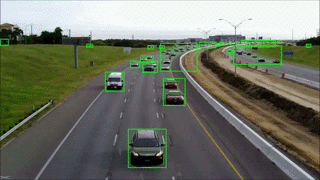

# MotionTracker

MotionTracker is a library that uses OpenCV 2.4.10 to detect movement in a video. 
The library uses two different algorithms that are talked in more detail in the report file.
Here are examples of outputs when the program is given a video file.

